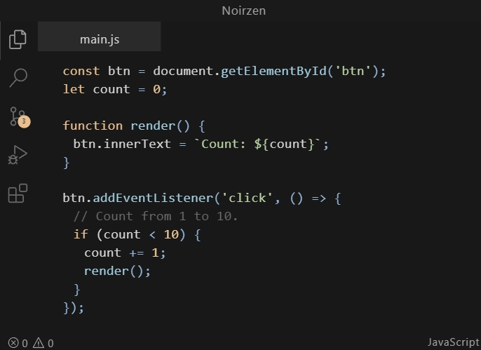

# Noirzen Theme

**Sleek. Dark. Effortlessly Minimal.**

## Overview

Noirzen is a meticulously crafted dark theme for VS Code designed to reduce eye strain during long coding sessions while maintaining excellent readability. Featuring a carefully selected pastel color palette and premium bundled coding fonts, Noirzen provides an elegant and distraction-free coding environment.

## Features

- **Elegant Dark Interface** - Carefully balanced dark background with subtle contrast for reduced eye strain
- **Pastel Color Palette** - Thoughtfully selected colors that harmonize beautifully together
- **Bundled Premium Fonts** - Includes optimized coding fonts for the best reading experience
- **Semantic Highlighting** - Enhanced token coloring for better code comprehension
- **Frosted Glass UI** - Beautiful semi-transparent menus and popups with advanced blur effects
- **Performance Optimized** - Lightweight theme with smooth animations that don't impact editor performance

## Color Palette

| Color | Hex | Usage |
|-------|-----|-------|
| Orange | `#e8c090` | Keywords, Control Flow |
| Light Orange | `#f0cc9a` | Numbers, Constants |
| Green | `#b8d1a1` | Strings |
| Blue | `#91B4D5` | Operators, Punctuation |
| Cyan | `#a1ccdd` | Functions, Methods |
| Red | `#e28d78` | Tags, Errors |

## Screenshot

  

## Installation

1. Open **Extensions** sidebar in VS Code (`Ctrl+Shift+X` or `Cmd+Shift+X`)
2. Search for `Noirzen Theme`
3. Click **Install**
4. Click **Reload** to reload VS Code
5. Open the Command Palette (`Ctrl+Shift+P` or `Cmd+Shift+P`) and select **Preferences: Color Theme** → **Noirzen**

## Supported Languages

Noirzen Theme has been carefully optimized for a wide range of languages:

- JavaScript/TypeScript
- HTML/CSS/SCSS
- Python
- Java
- C/C++
- Go
- Rust
- PHP
- Ruby
- Markdown
- JSON/YAML
- And many more!

## Updates & Roadmap

### Recent Updates
- Initial release of Noirzen Theme
- Added semantic highlighting support
- Optimized terminal colors

### Upcoming Features
- Theme customization options
- More language-specific optimizations

## Contributing

Contributions are welcome! Feel free to:

- Report bugs
- Suggest enhancements

## License

This theme is released under the [MIT License](https://github.com/Q2x38b/noirzen/blob/main/LICENSE.md).

## Acknowledgments

Special thanks to:
- The VS Code team for their amazing platform
- [Font creators] for the bundled fonts
- [Theme inspirations] for inspiration
- All our contributors and users!

---

  
Crafted with ❤️ by <a href="https://e108.dev">@e108</a>

